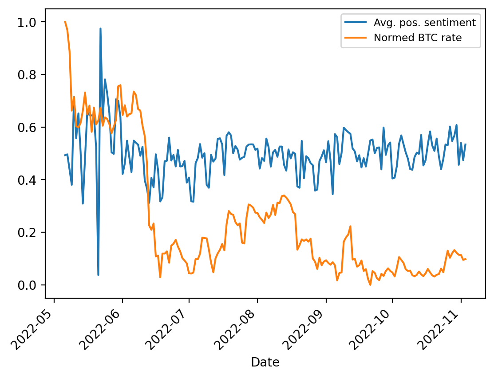
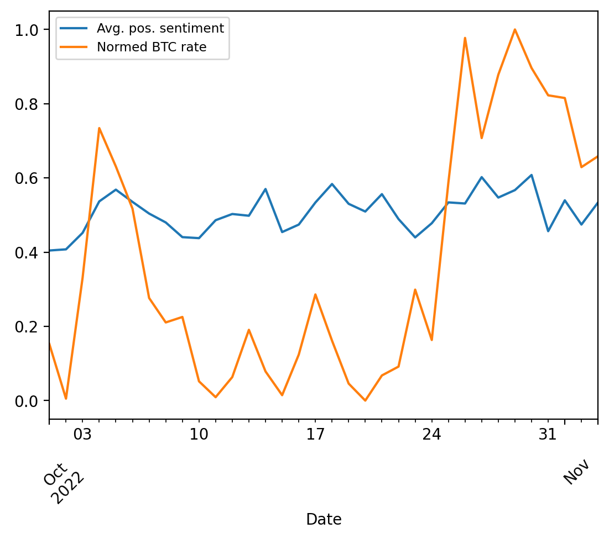

# Cryptonews Sentiment Jupyter Notebooks

[Project description](https://www.notion.so/42e0593fcf9d48a78f503c7a3d0bc619) (Russian only).

## Setting up the environment 

Run `bash setup_env.sh` (beware: `bash`, not `sh`). This will download and install Miniconda with Python 3.9 and install all dependencies from `gpu_environment.yml`.

## Experiments

1\. Fixed cross-validation folds for experiments: `data/folds.csv`, [notebook](notebooks/20220411_btc_4500_titles_fix_folds_for_validations.ipynb). The baseline tf-idf & logreg model hits 72.1% accuracy in this setup. 

2\. Learning curves built for the baseline model: [task](https://www.notion.so/a74951e4e815480584dea7d61ddce6cc?v=dbfdb1207d0e451b827d3c5041ed0cfd&p=41d93e8bcd0a47949d0ed92f0f6592eb), [notebook](notebooks/20220408_btc_4500_titles_logit_tfidf_learning_curves.ipynb). Adding new labeled data helps.

3\. [This notebook](notebooks/20220413_scrape_bitcointicker_news_prepare_batches_for_annotation.ipynb) scrapes [https://bitcointicker.co/news](https://bitcointicker.co/news/) (Selenium + BeautifulSoup) and examines prediction entropy which is a way to distinguish easy and hard examples. 

4\. [This notebook](notebooks/20220415_scrape_bitcointicker_news_perform_eda.ipynb) scrapes some more Bitcointicker news (27k) and performs basic EDA with the following outcomes:

- ~27k news titles are saved locally and to the `cryptonews.bitcointicker_news` Mongo collection
- Filtering based on presence of at least one verb seems to make sense
- Most of the titles under 4 words in length make no sense. Starting from 4 words is reasonable
- Placeholder titles need to be removed. E.g. "Bitcoin daily chart alert" is seen >90 times. 

5\. Annotator accuracy as measured against the majority vote ranges from 81% to 90% while Tf-Idf & logreg baseline hits 69% only - [notebook](notebooks/20220420_analyze_amt_assessment_two_trial_batches.ipynb).

6\. [This notebook](notebooks/20220426_RSS_parser_example.ipynb) shows an example of RSS feed parsing to obtain cryptonews titles.

7\. [This notebook](notebooks/20220430_btc_4500_titles_and_assessment_data_checklist.ipynb) provides several examples how to test a model with the checklist package (https://github.com/marcotcr/checklist)

8\. [This notebook](notebooks/20220530_get_rss_feed_news_perform_eda.ipynb) crawls RSS feeds and performs an EDA to come up with filtering rules: on publication timestamp, title length, excluding records without a verb, also non-English records, etc.

9\. [This notebook](notebooks/20220530_adversarial_validation_for_data_drift_train_vs_recent_rss_feeds.ipynb) runs adversarial validation to detect data drift – even a simple tf-dif&logreg model can easily distinguish the training set (2017-2018) from the new records from RSS feeds (2022). Also, the features that drifted most are visualized.  

10\. [This notebook](notebooks/20220625_calibrate_bert_probs.ipynb) trains bert model with probability calibration.

11\. [This notebook](notebooks/20220418_active_learning_survey.ipynb) compares several active learning approaches.

12\. [This notebook](notebooks/20220715_explore_model_errors_with_400_labeled_news_from_RSS_feeds.ipynb) validates BERT predictions w.r.t. to 400 news titles from RSS feeds that were hand-labeled in June-July 2022. The model is only 50% accurate. Moreover, model errors are typically confirmed when compared to human labels: either the model is indeed wrong, or the case is controversial.

13\. [Here](notebooks/20221108_correlate_sentiments_with_btc_price.ipynb) we plot daily average predicted positive sentiments vs. daily BTC price for the period May 2022 - Nov 2022. And, not surprisingly, find no meaningful correlation, aboyt 27% Pearson. 

Well, for October 2022, the correllation is 47% and visibly, two series correlate much better, but the model/data are hardly good enough to pursue this further.

